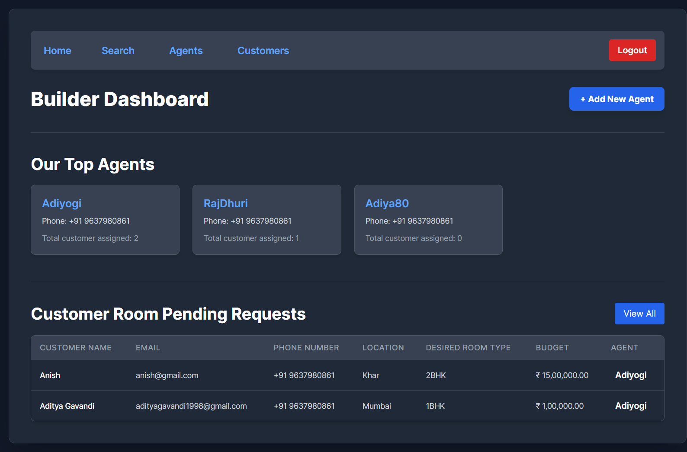
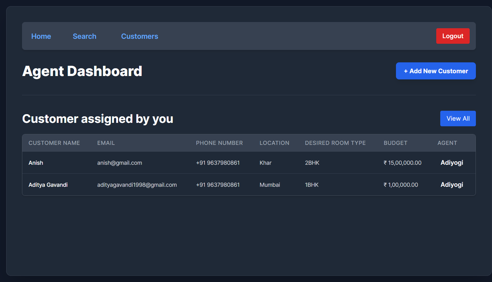
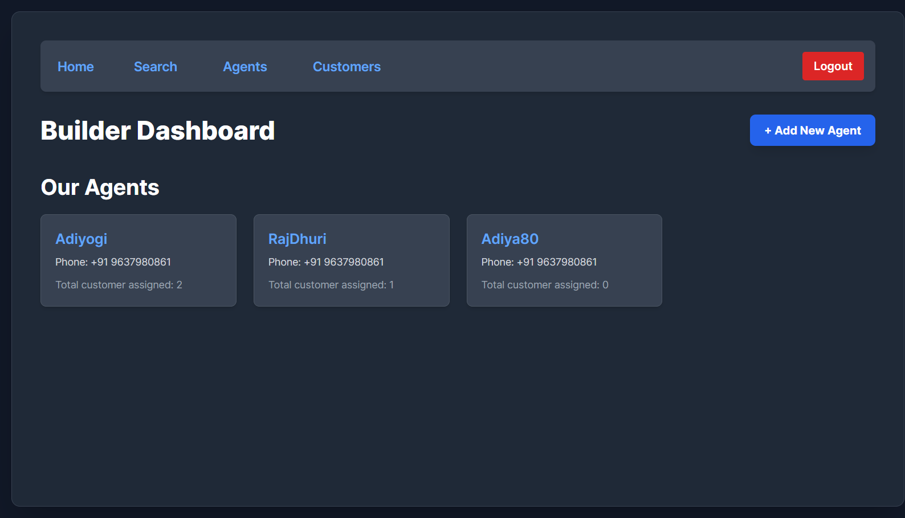
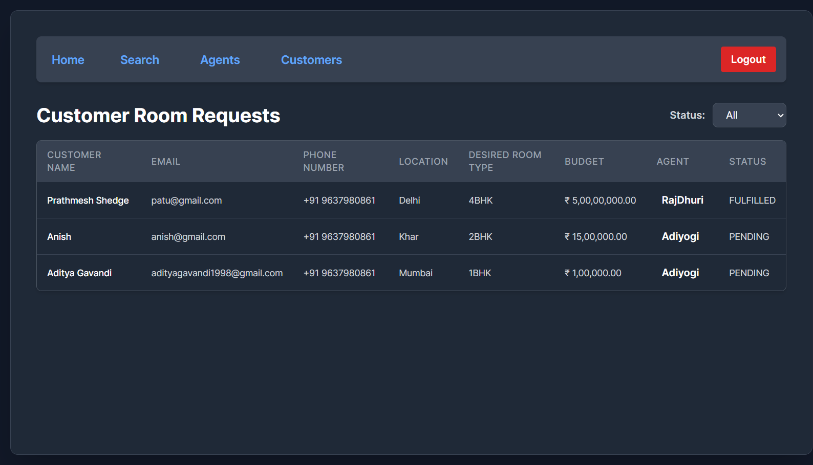
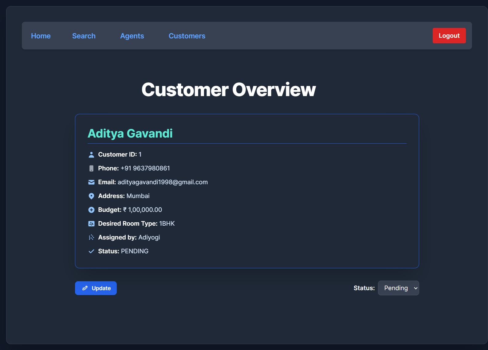
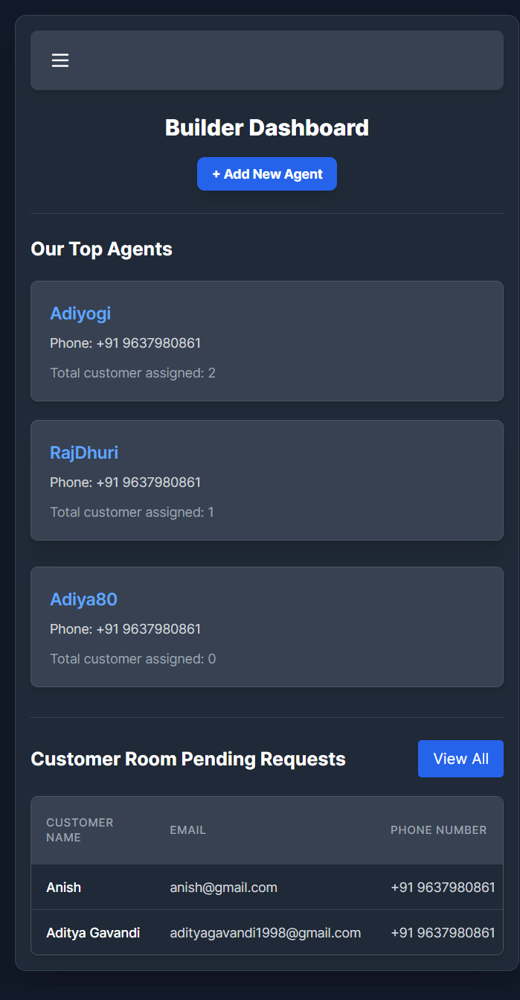

# BuilderSite

A project repository designed to streamline collaboration and workflow management for real estate builders, agents, and their clients.  
**Developed within just 3 hours.**

## Description

Rajaso is a site designed for builders and agents to efficiently manage customers and agents. It streamlines interactions, assignments, and workflows between builders, agents, and their clients.

## Features

- Assignment tracking and management
- Organized workspace structure
- Easy to extend and maintain

## Project Screenshots

Below are the available screenshots from the `assets` folder:

- **BuilderSite Screenshot**

    

- **AgentSite Screenshot**

    

- **Builder Agent Preview**

    

- **Builder & Agent Customer Preview**

    

- **Customer Preview for Both**

    

- **Responsive UI**

    


1. **Clone the repository:**
    ```bash
    git clone https://github.com/adityagavandi2003/buildersite.git
    ```
2. **Navigate to the project directory:**
    ```bash
    cd folder_name
    ```
3. **Install dependencies:**
    ```bash
    pip install -r requirements.txt
    ```

4. **Apply migrations:**
    ```bash
    python manage.py migrate
    ```

5. **Run the development server:**
    ```bash
    python manage.py runserver
    ```

## Folder Structure

```
/folder_name
  ├── src/
  ├── README.md
  └── ...
```

##
this project made for only 
## Contributing

Contributions are welcome! Please open issues or submit pull requests.

## License

This project is licensed under the MIT License.